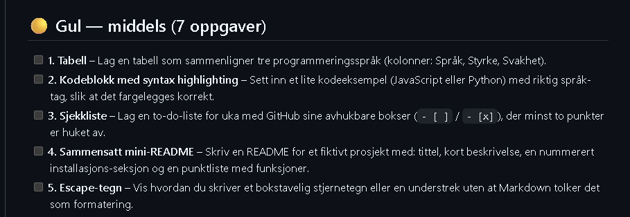

# Markdown

---

# Grønn

---

#### Overskrifter
# H1
## H2
### H3

---

#### Tekstformattering
###### Tekst om meg
Jeg heter Elias Iisakki Mattila Nilsen og jeg går på Breivang videregående skole.
På fritiden liker jeg å spille dataspill og basketball, jeg liker også å jobbe med programmering å video redigering.
Etter skolen vil jeg bli utvikler og vil helst få lærlingsplass hos KSAT.

---

#### Lister
###### Hobbyer
* spille basketball
* spille dataspill
* redigere videoer

###### Mål for skoleåret
1. få praksis plass hos KSAT
2. lære mer om utvikling
3. lære hvordan jeg setter opp en server

---

#### Lenker
[Breilan sin nettside](https://breilan.no/index.html)

---

#### Bilder


---

#### Sitat
[Vi lever i et samfunn uhyre avhengig av vitenskap og teknologi, hvor nesten ingen vet noe om vitenskap og teknologi.][ref]

[ref]: https://www.ordtak.no/sitat.php?id=14570

---

#### Skillelinje
Jeg har brukt det gjennom hele dokumentet.

---

#### Inline koding
HTML taggen H1 er overskriften til nettsiden.

---

# Gul

---

| Språk | Styrke | Svakhet|
|:-------:|:--------:|:--------:|
|Javascript|vet ikke|allt|
|Python|er et ganske lett språk å forstå bra for nybegynnere|bare dårlig|
---

#### Kodeblokk
``` python
print("Hello World!")
```

---

#### Sjekkliste
- [ ] kjøpe sekiro
- [x] kjøpe how to fish
- [ ] jobbe på torsdag
- [x] kjøpe ukulele strenger
- [ ] redigere ane sine mincraft videoer.

---

## Gronking

---

#### Description
**_Gronking_** is a game inspired by the street fighter games where there are 2 players in a 2d area and they fight eachother.

---

#### Nedlastnings instruksjoner
1. last ned zip-filen
2. extract zip-filen
3. run .exe filen
4. spill spillet

---

#### Funksjoner
1. angrep
2. movement

---

#### Escape tegn
\*

---

# Rød

---

#### Badges


---

#### Fotnoter
Hva er ram?
<details>
<summary>vis svar</summary>
korttidsminne

---
